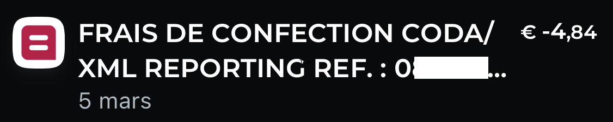

# demo-coda-export

Convert CSV bank exports from Revolut Business, Revolut Personal, Qonto, N26, or Wise into CODA files — the Belgian standard your accountant needs.

Built with Bun + TypeScript. Zero runtime dependencies. MIT licensed.

## Setup

```bash
git clone <repo-url> && cd demo-coda-export
bun install
```

Create a config file interactively — you provide your IBAN, the rest is auto-derived:

```bash
bun run src/cli.ts init
```

## Usage

```bash
# Export your transactions as CSV from your bank, then:
bun run src/cli.ts convert --input transactions.csv --config my-account.json

# That's it. Hand the .cod file to your accountant.
```

The bank format is auto-detected from the CSV headers. The `--output` flag lets you choose the output filename; otherwise it defaults to `output.cod`.

Other commands:

```bash
bun run src/cli.ts validate --input statement.cod        # check a CODA file
bun run src/cli.ts compare --a old.cod --b new.cod       # diff two CODA files
bun run src/cli.ts --help                                # all options
```

## Why this exists

A lot of Belgian accountants require CODA files. Traditional Belgian banks charge for them — typically around 5 EUR/month per account, which is a remarkably creative way to monetise a file format from the 1990s.

<p align="center">
  
  <br />
  <em>Spot something like this in your monthly fees? That's a file conversion charge.</em>
</p>

Meanwhile, neobanks like Revolut, Qonto, N26, and Wise offer rather better digital banking experiences but don't produce CODA files, because why would they. This leaves you choosing between a modern bank and a format your accountant will accept.

This tool removes that choice. Export CSV, run the converter, get a valid CODA 2.6 file.

It is a clean-room implementation based on the [Febelfin CODA 2.6 specification](https://febelfin.be/media/pages/publicaties/2021/gecodeerde-berichtgeving-coda/fd115cfb8b-1694763197/standard-coda-2.6-nl-1.pdf) and the [EPBF format description](https://www.epbf.be/sites/default/themes/custom/zen_epbf/images/pdf_doc/format_description_CODA.pdf). Output has been validated with [pycoda](https://github.com/acsone/pycoda), tested against real Belfius CODA exports for structural compatibility, and verified by an accountant.

## Limitations

- **Writer only** — this tool produces CODA files, it does not parse them.
- **One account per file** — the CODA format supports multiple account sections; this tool does not.
- **EUR only** — untested with other currencies.
- **Transaction codes are best-effort** — the family/operation codes are reasonable approximations, not exact replicas of what a Belgian bank would assign. Accounting software that relies on these codes for categorisation may behave differently. See [SCOPE.md](SCOPE.md) for the full details.

If you hit a problem or find another limitation, [open an issue](../../issues).

## License

MIT — see [LICENSE](LICENSE).
